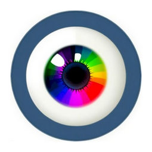
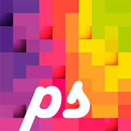
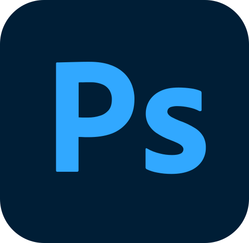
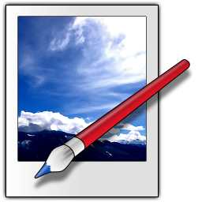
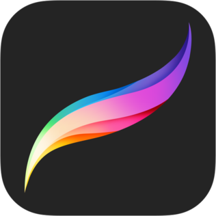
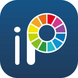

# 픽셀아트 프로그램 목록

::: info :bulb: 오픈소스에 대해서
오픈소스로 표시돼 있는 건 소스코드는 다 무료로 열려있는데 패키징 배포가 무료로 거기에 안돼있다는 말임  
Aseprite 같이 유명한 건 검색하면 하는 방법 나옴

Gemini나 GPT같이 AI 구독 쓰고 있는 사람은 VS Code 깔아서 전용 공식 코딩용 익스텐션 깔고  
"해줘"하면 쉽게 할 수 있고  
없는 사람은 깃허브 VS Code에 `GitHub Copilot Chat`익스텐션 깔고  
VS Code에 깃허브 로그인해서 Gemini 3 Flash 나 Pro 선택하고 무료 할당량으로 "해줘" 하면 됨
:::

::: info :bulb: OS 설명
- 아이폰 - **iOS**
- 아이패드 - **iPadOS**
- 그 외 모든 휴대기기 - **Android**
:::

## Aseprite {#aseprite}

**PC** &nbsp; `Windows` `Mac` `Linux`  

> **현업에서 많이 실사용됨**  

> 드로잉, 에니메이팅, 플러그인 지원, 한국어 유저번역 지원

- [Github](https://github.com/aseprite/aseprite) &nbsp; `오픈소스`
- [Steam](https://store.steampowered.com/app/431730/Aseprite) &nbsp; `₩ 20,500`
- [itch.io](https://dacap.itch.io/aseprite) &nbsp; `$ 19.99 USD`

> https://www.aseprite.org

## Pixquare {#pixquare}

**PC, 모바일** &nbsp; `Mac` `iOS` `iPadOS`  

> **많이 실사용됨**  

> 드로잉, 에니메이팅, 한국어 기계번역 지원

- [Apple App Store](https://apps.apple.com/us/app/pixquare-pixel-art-studio/id1659428179)  
    `모든 기기 ₩ 29,000` `iPad ₩ 25,000` `iPhone ₩ 11,000`

> https://www.pixquare.art

## Resptire {#resprite}

Resprite: **PC, 모바일** &nbsp; `Mac` `iOS` `iPadOS`   
Resprite DA: **PC, 모바일** &nbsp; `Windows` `Mac` `Android`

> **Android 에서 많이 실사용됨**  

> 드로잉, 에니메이팅, 한국어 기계번역 지원

- Resprite
  - [Apple App Store](https://apps.apple.com/us/app/resprite-pixel-art-studio/id1662335989)  
    `한달 ₩ 3,300` `12개월 ₩ 19,000` `영구구매 ₩ 33,000`
- Resprite DA
  - [Steam](https://store.steampowered.com/app/3146020/Resprite/) `&nbsp; ₩ 21,500`
  - [Google Play](https://play.google.com/store/apps/details?id=com.fengeon.resprite_desktop)  
  `한달 ₩ 3,300` `12개월 ₩ 16,000` `영구구매 ₩ 33,000`

> https://resprite.fengeon.com

## Pro Motion NG {#pro-motion-ng}

**PC** &nbsp; `Windows`   

> **현업에서 많이 실사용됨**  

> 드로잉, 에니메이팅

- [공식 홈페이지 라이선스 키 구매](https://www.cosmigo.com/pixel_animation_software/buy) &nbsp; `$ 19.00`
- [Steam](https://store.steampowered.com/app/671190/Pro_Motion_NG/) &nbsp; `₩ 27,000`

> https://www.cosmigo.com

## Pixel Studio {#pixel-studio}

**PC, 모바일** &nbsp; `Windows` `Mac` `Android` `iOS` `iPadOS`

> 드로잉, 에니메이팅, 한국어 일부 지원

- [Steam](https://store.steampowered.com/app/1204050/Pixel_Studio__pixel_art_editor/) &nbsp; `무료`
- [Microsoft Store](https://apps.microsoft.com/detail/9p7xs7vh1r3j?hl=en-US&gl=US) &nbsp; `무료`
- Google Play
  - [Pixel Studio](https://play.google.com/store/apps/details?id=com.PixelStudio) `무료`
  - [Pixel Studio PRO ](https://play.google.com/store/apps/details?id=com.pixelstudio.pro) `₩ 8,900`
- Apple App Store
  - [Pixel Studio](https://apps.apple.com/us/app/pixel-studio-for-pixel-art/id1404203859) `무료`
  - [Pixel Studio PRO ](https://apps.apple.com/us/app/pixel-studio-pro-for-pixel-art/id1476932307) `₩ 19,000`
- [Mac App Store](https://apps.apple.com/us/app/pixel-studio-for-pixel-art/id1477015249?mt=12) `무료`

## PixiEditor {#pixieditor}

**PC** &nbsp; `Windows` `Linux` `Mac`

> 드로잉, 에니메이팅, 노드 컴포지팅, 벡터 드로잉

- [공식 홈페이지](https://pixieditor.net/download) &nbsp; `무료`
- [Github](https://github.com/PixiEditor/PixiEditor) &nbsp; `오픈소스`
- [Steam](https://store.steampowered.com/app/2218560/PixiEditor/) &nbsp; `무료`
- [itch.io](https://pixieditor.itch.io/pixieditor) &nbsp; `무료`

> https://pixieditor.net

## Pixel Composer {#pixel-composer}

**PC** &nbsp; `Windows` `Linux`

> **노드 컴포지팅및 동적 에니메이션 메인**

> 드로잉, 에니메이팅, 노드 컴포지팅, 3D 렌더링, 본 에니메이션, 스크립팅 지원, 한국어 유저번역 지원

- [Github](https://github.com/Ttanasart-pt/Pixel-Composer) &nbsp; `오픈소스`
- [Steam](https://store.steampowered.com/app/2299510/Pixel_Composer/) &nbsp; `₩ 11,000`
- [itch.io](https://pixieditor.itch.io/pixieditor) &nbsp; `$ 10.00`

> https://pixel-composer.com

## PixelOver {#pixelover}

**PC** &nbsp; `Windows`

> **본 리깅 및 동적 에니메이션 메인**

> 에니메이팅, 3D 렌더링, 본 에니메이션

- [Steam](https://store.steampowered.com/app/2299510/Pixel_Composer/) &nbsp; `₩ 21,000`
- [itch.io](https://pixieditor.itch.io/pixieditor) &nbsp; `$ 30.00`

> https://pixelover.io

 
 

---

 
 
 

# 픽셀아트에 사용이 가능한 프로그램 목록

::: info :bulb: 픽셀아트가 가능한 프로그램 목록
픽셀아트 전용 프로그램은 아니지만 실제로 픽셀아트에 사용돼는 프로그램 목록

"현업에서 많이 사용됨"은 픽셀아트 기준
:::

## Adobe Photohop {#photoshop}

**PC, 모바일** &nbsp; `Windows` `Mac` `Android` `iOS` `iPadOS`

> **현업에서 많이 실사용됨**

> 드로잉, 에니메이팅, 플러그인 지원, 한국어 지원

> https://www.adobe.com/kr/products/photoshop.html

## Krita {#krita}

**PC, 모바일** &nbsp; `Windows` `Mac` `Linux` `Android` `iOS` `iPadOS`

> 드로잉, 에니메이팅, 플러그인 지원, 한국어 유저번역 지원

- [공식 홈페이지](https://krita.org/ko/download/) &nbsp; `무료`
- [Github](https://github.com/KDE/krita) &nbsp; `오픈소스`
- [Steam](https://store.steampowered.com/app/280680/Krita/) &nbsp; `₩ 11,000`
- [Epic Games Store](https://store.epicgames.com/ko/p/krita) &nbsp; `₩ 10,000`
- [Microsoft Store](https://apps.microsoft.com/detail/9n6x57zgrw96?hl=en-US&gl=US) &nbsp; `$ 14.99`
- [Mac App Store](https://apps.apple.com/us/app/krita/id1594607976?mt=12) &nbsp; `$ 12.99`

> https://krita.org

## Clip Studio {#clip-studio}

**PC, 모바일** &nbsp; `Windows` `Mac` `Android` `iOS` `iPadOS`

> 드로잉, 에니메이팅, 플러그인 지원, 한국어 지원

> https://www.clipstudio.net

## Paint.NET {#paintnet}

**PC** &nbsp; `Windows` `Mac` `Linux` `Android` `iOS` `iPadOS`

> 드로잉, 플러그인 지원, 한국어 지원

- [공식 홈페이지](https://www.getpaint.net/download.html) &nbsp; `무료`
- [Github Release](https://github.com/paintdotnet/release/releases) &nbsp; `무료`
- [Microsoft Store](https://apps.microsoft.com/detail/9nbhcs1lx4r0?hl=ko-KR&gl=KR) &nbsp; `₩ 18,900`

> https://www.getpaint.net

## Procreate {#procreate}

**모바일** &nbsp; `iPadOS`

> 드로잉, 한국어 지원

- [Apple App Store](https://apps.apple.com/us/app/procreate/id425073498) &nbsp; `₩ 19,000`

> https://procreate.com

## Ibis Paint {#ibis-paint}

**PC, 모바일** &nbsp; `Windows` `Mac` `Android` `iOS` `iPadOS`

> 드로잉, 한국어 지원

- [Google Play](https://play.google.com/store/apps/details?id=jp.ne.ibis.ibispaintx.app)
- [HUAWEI AppGallery](https://appgallery.cloud.huawei.com/ag/n/app/C101937815?channelId=ibis+Paint+X&id=1aca11bdc8c04e02b448b7041ad23458&s=7DCDF1D53C5F00D7B84370F01893FC42642EB17DF997B04B84F24C8B7692023C&detailType=0&v=)
- [Apple App Store](https://itunes.apple.com/kr/app/id450722833?mt=8)
- [Microsoft Store](https://www.microsoft.com/store/apps/9PFDF2ZD4Z4N)
- [Mac App Store](https://apps.apple.com/us/app/ibispaint-your-art-studio/id6737590363)

::: info 🧾 가격
유로앱이 따로 있는데 그냥 광고제거임  
무료에서 인앱 구매하는거랑 똑같음

|플랫폼|기본가격|광고제거|전문 부가 기능|프라임 멤버십 월별 플랜|프라임 멤버십 연간 플랜|
|-|-|-|-|-|-|
|모바일|무료|₩ 1,5000|없음|월 ₩ 3,800|연 ₩ 34,000|
|Windows|유로|광고 없음|$29.49|월 $2.99|연 $27.99|
|Mac|유로|광고 없음|$29.49|월 $2.99|연 $29.99|

PC는 원화 책정이 제대로 안돼있어서 구매가 제대로 안돼는것 같음  
아마 구매 할려면 문의가 필요할듯

:::

> https://ibispaint.com

