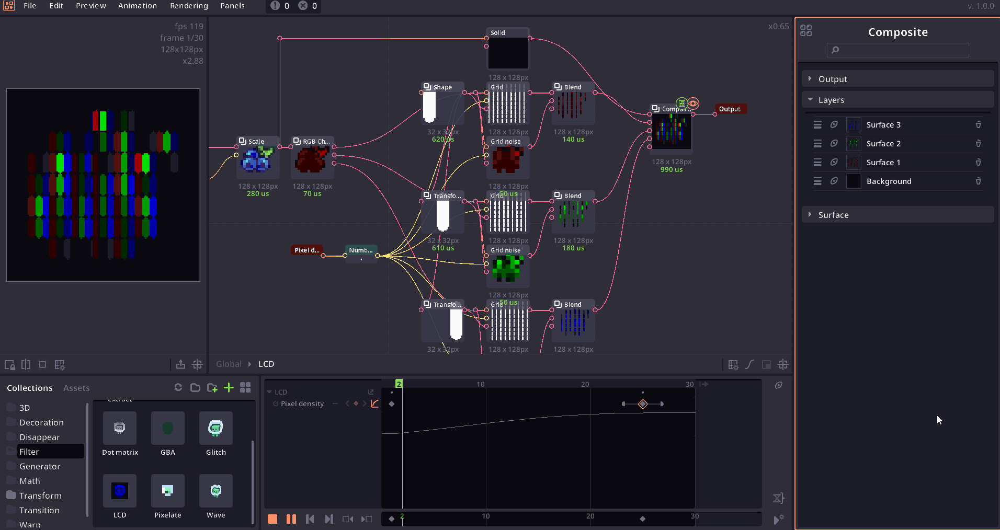
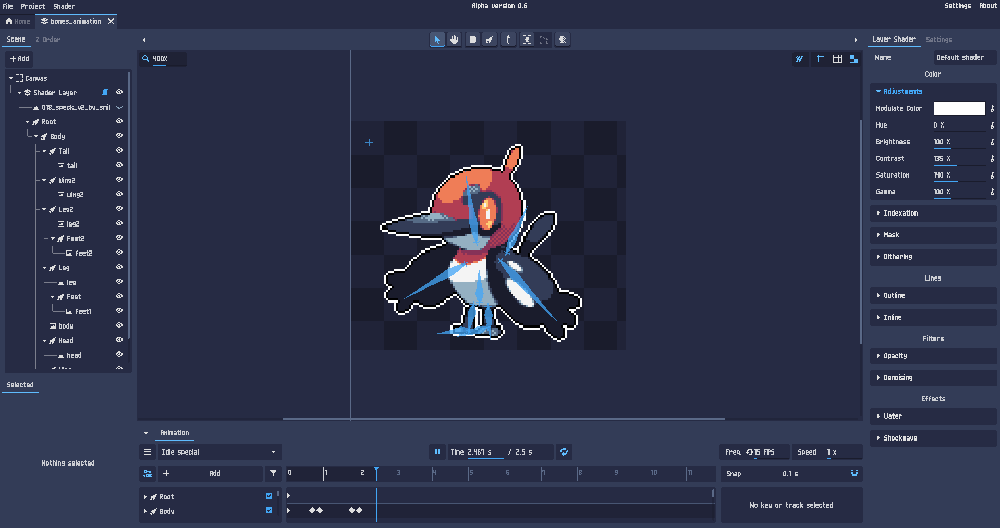

# 픽셀아트 프로그램 목록

픽셀아트 작업시 유용하게 사용할 수 있는 프로그램 목록

::: info :bulb: **오픈소스**에 대해서
다운로드 링크 옆에 `오픈소스`로 표시돼 있는 건 소스코드는 다 무료로 열려있는데 패키징 배포가 무료로 거기에 안돼있다는 말임  
Aseprite 같이 유명한 건 검색하면 하는 방법 나옴
:::

::: info :bulb: OS 설명
- 아이폰 - **iOS**
- 아이패드 - **iPadOS**
- 그 외 모든 휴대기기 - **Android**
:::

## Pixel Composer {#pixel-composer}

> ⭐ **추천**

**PC** &nbsp; `Windows` `Linux`

노드 기반으로 픽셀아트를 컴포지팅하거나 프로시듀얼 워크플로우로 픽셀아트를 작업할 수 있는 툴.  
주로 파티클, 이펙트 제작, UI 에니메이팅에 씌임.  
키프레임 에니메이션및 값에 스크립팅 지원.

> 드로잉, 에니메이팅, 노드 컴포지팅, 3D 렌더링, 본 에니메이션, 스크립팅 지원, 에셋 포함, 한국어 유저번역 지원

- [Github](https://github.com/Ttanasart-pt/Pixel-Composer) &nbsp; `오픈소스`
- [Steam](https://store.steampowered.com/app/2299510/Pixel_Composer/) &nbsp; `₩ 11,000`
- [itch.io](https://pixieditor.itch.io/pixieditor) &nbsp; `$ 10.00`

> https://pixel-composer.com

## PixelOver {#pixelover}

**PC** &nbsp; `Windows`

불러온 픽셀아트를 리깅 베이스 에니메이팅, 컴포지팅 할 수 있는 툴

> 에니메이팅, 3D 렌더링, 본 에니메이션

- [Steam](https://store.steampowered.com/app/2299510/Pixel_Composer/) &nbsp; `₩ 21,000`
- [itch.io](https://pixieditor.itch.io/pixieditor) &nbsp; `$ 30.00`

> https://pixelover.io

## PixXels {#pixzels}

**PC** &nbsp; `Windows`

여러면의 픽셀아트를 불러와 3D화 후 에디팅. 렌더링 할 수 있는 툴

> 드로잉, 3D 렌더링

- [itch.io](https://pixel-salvaje.itch.io/pixzels) &nbsp; `$ 12.00`

