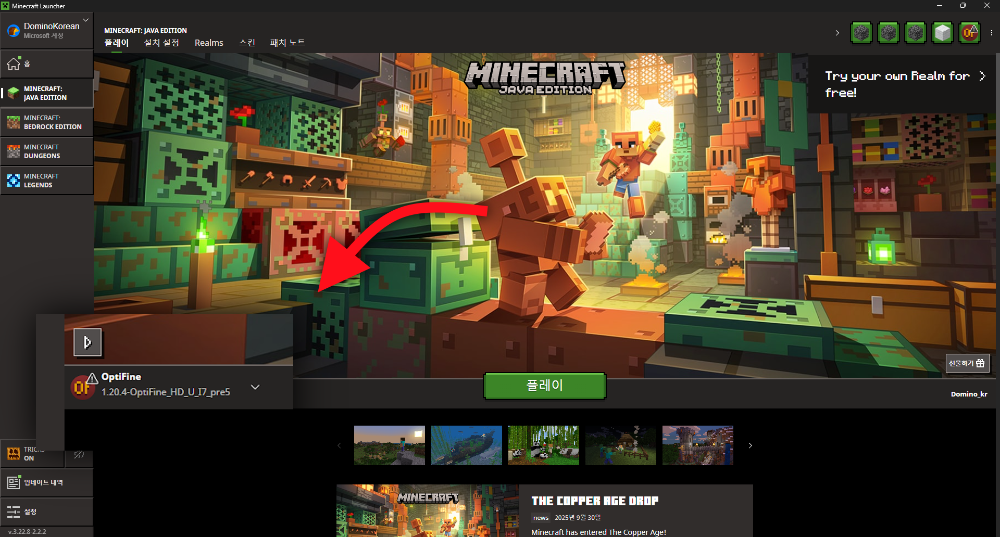
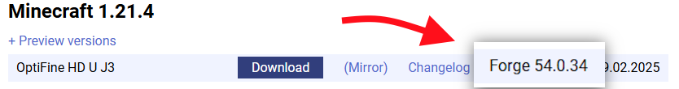
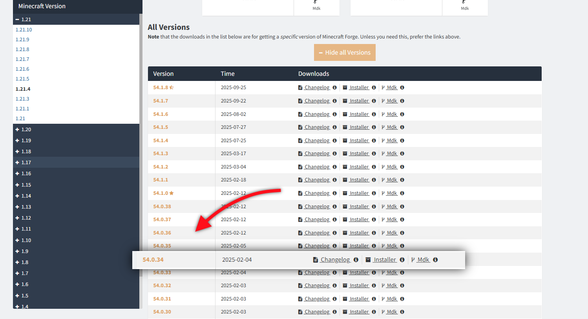

# 옵티파인 설치법

::: tip 💡 참고
한국에 있는 관련 자료들이 너무 오래되었거나 파편화되어 있어 따로 정리한 문서입니다.  
모든 버전에서 동일하게 사용 가능한 방식입니다.
:::

::: info ⚠️ 필독
최신 버전은 옵티파인 사용을 권장하지 않습니다.  
각 버전별 셰이더 설치에 필요한 모드는 [버전별 셰이더팩 설치 필요 모드](/java/what_shader_mod/what_shader_mod.md)를 참고해 주세요.

옵티파인의 가장 최신 버전의 프리뷰 버전은 셰이더를 포함한 여러 기능이 포함되지 않을 수 있습니다.

옵티파인은 다른 모드와 호환성이 매우 안 좋습니다.  
만약 다른 모드와 함께 사용하는 경우 셰이더를 위해 Iris Shader 모드를 사용해 주세요.
:::

## 옵티파인 단독 설치

### 1. 파일 다운로드
메인 홈페이지에서 원하는 마인크래프트 버전으로 옵티파인 설치기 파일을 다운로드해 줍니다.  
https://optifine.net/downloads

만약 다운로드 버튼을 눌렀을 때 Adfocus 중간 광고 링크가 제대로 작동하지 않을 경우  
다운로드 버튼 바로 옆에 `(Mirror)`글씨를 클릭하면 다운로드할 수 있습니다. 

### 2. JAVA 설치
JAVA 형식의 앱을 실행하려면 JAVA를 설치해줘야 합니다.  
아래 링크에서 설치 프로그램을 다운로드하여 JAVA를 설치해 줍니다.
https://www.java.com/ko/download

### 3. 옵티파인 설치기 실행
다운로드한 옵티파인 파일을
1. 우클릭 후
2. **연결 프로그램**에 마우스를 가져다 댄 다음
3. **다른 앱 선택**을 눌러서
4. **JAVA(TM) Platform SE Binary**를 한번 클릭한 다음
5. 아래에 **항상**버튼을 누릅니다.

이렇게 하면 앱 아이콘이 JAVA로 바뀌면서 이제 더블클릭만 하면 항상 JAR 형식의 앱을 자바로 실행할 수 있게 됩니다.  
(윈도우 10, 11 동일)

### 4. 옵티파인 설치
옵티파인 파일을 더블 클릭해 설치기를 실행합니다.  
그 후 Install 버튼을 눌러 설치합니다.  

::: info ⚠️ 만약 실행이 되지 않는 경우
검은 창이 잠시 떴다 꺼지거나 아예 실행이 안 되는 경우  
Jarfix를 설치하시면 대부분 해결됩니다.   

https://johann.loefflmann.net/en/software/jarfix/index.html  
링크에 들어간 후 밑으로 조금만 내려서  
**Requirements** 아래 **FAQ** 위에 **Download**가 있는데  
거기서 **Download from the authors' website:** 라고 써진 부분 바로 아래에  
`jarfix.exe`라고 파란 글씨로 써져 있는 걸 클릭해 다운로드해  
실행해서 Jarfix를 설치합니다.  

만약 설치를 다 해도 안될 경우 컴퓨터를 재시작해보시면 해결됩니다.
:::

### 5. 옵티파인 실행
공식 런처를 실행해 왼쪽 아래에 버전이 옵티파인으로 돼있는지 확인합니다.  

::: danger ⚠️ 참고
옵티파인을 설치할 때 런처가 켜져 있었을 경우 런처를 재시작해주셔야 합니다.  
런처를 재시작해도 없을 경우 런처를 끈 채로 옵티파인을 다시 설치해 주시면 됩니다.
:::

이제 플레이를 누르시면 옵티파인으로 플레이하실 수 있습니다.

## 다른 모드와 함께 사용 시

::: info 💡 참고
이미 모드 로더와 다른 모드가 설치되어 있다는 가정 하에 작성된 글입니다.  

패브릭에서는 옵티 패브릭 외엔 방법이 없습니다.
:::

 

### 옵티 포지, 옵티 패브릭 사용 (권장)
모드 파일과 옵티파인을 같이 넣으면 실행이 가능한 모드입니다.
- [옵티 포지](https://www.curseforge.com/minecraft/mc-mods/optiforge/files/all?page=1&pageSize=20&showAlphaFiles=show)
- [옵티 패브릭](https://www.curseforge.com/minecraft/mc-mods/optifabric/files/all?page=1&pageSize=20&showAlphaFiles=show)

가장 간단한 방법이지만 둘 다 개발 지원이 끊겼기 때문에 지원 버전 범위 내에서만 사용이 가능합니다.  

 

### 포지에서 직접 설치
옵티파인은 포지 모드입니다.  
옵티파인을 mod 폴더에 넣고 포지의 세부 버전을 맞추면 실행이 가능합니다.  

먼저 다운로드할 때 지원하는 포지의 세부 버전을 다운로드 버튼 쪽 우측에서 확인합니다.  

포지 다운로드 페이지에서 하단에 주황색 `+ Show All Versions` 버튼을 클릭 후  
아래 펼쳐진 세부 버전에서 동일한 버전을 찾아줍니다.  
  

이제 해당 세부 버전에서 Installer 눌러서 다운로드 - 설치 - 실행해주시면 됩니다.

 

### 패브릭에서 대체용 모드팩 사용

패브릭에서는 옵티파인의 기능들을 지원하는 여러 모드와  
그 모드들을 포함 여러 모드들을 조합해 놓은 모드팩들이 있습니다.

Fabulously Optimized 모드팩을 사용하면 더 나은 모드 호환성, 더 나은 성능으로 플레이가 대신 가능합니다.  
모드팩은
[Modrinth APP](https://modrinth.com/app),
[Curseforge APP](https://www.curseforge.com/download/app),
[Prizm Launcher](https://prismlauncher.org/)
등 써드파티 런처로 설치할 수 있습니다.

- Fabulously Optimized
  - [Modrinth 다운로드](https://modrinth.com/modpack/fabulously-optimized/versions)
  - [Curseforge 다운로드](https://www.curseforge.com/minecraft/modpacks/fabulously-optimized/files/all?page=1&pageSize=20&showAlphaFiles=show)

::: danger ⚠️ 참고
**Realese (녹색 R) 버전**을 설치하셔야 옵티파인의 모든 기능을 쓸 수 있습니다.  
Alpha, Beta 버전은 미완성 버전으로 안정성을 보장하지 않습니다.
:::