::: warning :hammer: 공사중
현제 수정이 진행중이 문서입니다.
:::

# json 구문으로 리소스팩/데이터팩 설명 커스텀하기

::: info
본문에서는 json문법과 명령어를 모르고 있다와 pack.mcmeta의 기본적인 구조와 리소스팩의 기본적인 구조에 대해 알고 있다라는 전제 하에 설명하고있습니다.
:::

pack.mcmeta의 설명 부분에서는 명령어에서 씌이는 json 문법의 글씨효과를 일부 사용할 수 있습니다.

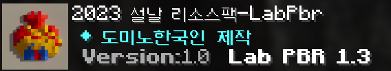

위 리소스팩에 씌인 pack.mcmeta를 예로 들자면

::: code-group
``` json [pack.mcmeta]
{
  "pack": {
    "pack_format": 15,
    "supported_formats":[15,46],
    "description": [
      { "text": " ◆ ", "color": "aqua", "bold": false },
      { "text": "도미노한국인 제작", "color": "aqua", "bold": true },
      { "text": "\n" },
      { "text": " Version:", "color": "gray", "bold": true },
      { "text": "1.0 ", "color": "gray", "bold": false },
      { "text": " Lab PBR 1.3 ", "color": "white", "bold": true }
    ]
  }
}
```
:::

이런식으로 기존의 `description { 내용... }`이 아닌  
` description [ { 커맨드1 }, { 커맨드2 }]` 같은 방식을 사용하고 있습니다.  

예를 들어

<p><span style="color: red;">안녕하세요</span> 여러분</p>

이라고 쓰고 싶다면

``` json
      { "text": "안녕하세요 ", "color": "red", "bold": true },
      { "text": "여러분 ", "color": "white", "bold": false }
```

이런식으로 작성할 수 있습니다.


## Json 문법

### text
쓰고 싶은 문자를 쓸 수 있습니다.  
`\n`을 통해 줄바꿈이 가능합니다.  
만약  
`"`  `'`  `,`  `\`  
기호를 쓰고 싶다면 이스케이프 문자라고 불리는 역슬래시`\`를 앞에 붙이면 됩니다.  
```json
 { "text": " \"안녕, 세상아!\" \n text 테스트 " }
```
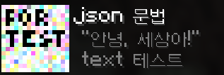

<br>

### color
글씨의 색을 지정할 수 있습니다.  
지정된 깁노 색상값 값이나 다른 원하는 색을 쓸 수 있습니다.  
다른 원하는 색을 쓰고 싶다면 hex 코드를 쓸 수 있습니다.


<!--@include: .\colorpick\hexcolorpicker.md-->


hex 코드는 위에 준비된 색상 선택 도구를 쓰거나 구글에 " [Google 색상 선택 도구](https://g.co/kgs/DSwfdSj) " 등을 검색해 사용할 수 있습니다.

<details>
  <summary>🎨 기본 색상값 목록</summary>
  <ul>
    <li style="color: #000000;">black</li>
    <li style="color: #0000AA;">dark_blue</li>
    <li style="color: #00AA00;">dark_green</li>
    <li style="color: #00AAAA;">dark_aqua</li>
    <li style="color: #AA0000;">dark_red</li>
    <li style="color: #AA00AA;">dark_purple</li>
    <li style="color: #FFAA00;">gold</li>
    <li style="color: #AAAAAA;">gray</li>
    <li style="color: #C6C6C6;">light_gray</li>
    <li style="color: #555555;">dark_gray</li>
    <li style="color: #5555FF;">blue</li>
    <li style="color: #55FF55;">green</li>
    <li style="color: #55FFFF;">aqua</li>
    <li style="color: #FF5555;">red</li>
    <li style="color: #FF55FF;">light_purple</li>
    <li style="color: #FFFF55;">yellow</li>
    <li style="color: #FFFFFF;">white</li>
    <li style="color: #DDD605;">minecoin_gold</li>
    <li style="color: #E3D4D1;">material_quartz</li>
    <li style="color: #CECAC9;">material_iron</li>
    <li style="color: #443A3B;">material_netherite</li>
    <li style="color: #971607;">material_redstone</li>
    <li style="color: #B4684D;">material_copper</li>
    <li style="color: #DEB120;">material_gold</li>
    <li style="color: #2CAA8A;">material_emerald</li>
    <li style="color: #1681AB;">material_diamond</li>
    <li style="color: #21497B;">material_lapis</li>
    <li style="color: #9A5CC6;">material_amethyst</li>
    <li style="color: #EB7114;">material_resin</li>
  </ul>
</details>

``` json
{"text": "안녕, ", "color": "light_purple"},
{"text": "세상아!", "color": "#B8AAFF"}
```
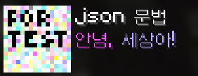

<br>

### shadow_color
글씨의 그림자 색을 지정할 수 있습니다.  
`[1.0, 1.0, 1.0, 1.0]` 형식으로 rgba를 지정할 수 있습니다.  
rgba가 255가 아닌 1~0 사잇값을 구하고 싶을 경우 변환기나 전용 색 선택 도구를 쓸 수 있습니다.  


참고로 적용하면 원래 색상과는 살짝 다르게 채도가 낮고 어두워질 수 있다.

``` json
{
    "text": "안녕, 세상아!",
    "color": "#edc177",
    "shadow_color": [0.82, 0.482, 0.247, 1.0]
}
```
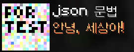

<br>

### bold

글씨를 **굵게** 할 수 있다.  
`true`, `false`로 설정할 수 있으며 `false`라면 bold를 굳이 쓰지 않아도 된다.
``` json
{ "text": "안녕, 세상아!", "bold": true }
```
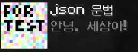

<br>

### italic
글씨를 _기울일_ 수 있다.  
위와 동일하게 `true`, `false`로 설정할 수 있으며 `false`라면 사용하지 않아도 된다.
```json
{ "text": "안녕, 세상아!", "italic": true }
```
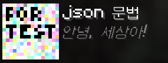

<br>

### underlined

글씨에 <ins>밑줄을</ins> 칠 수 있다.  
위와 동일하게 `true`, `false`로 설정할 수 있으며 `false`라면 사용하지 않아도 된다.
```json
{ "text": "안녕, 세상아!", "underlined": true }
```
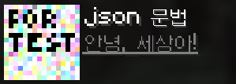

<br>

### strikethrough

글씨에 ~~취소선~~을 칠 수 있다.  
위와 동일하게 `true`, `false`로 설정할 수 있으며 `false`라면 사용하지 않아도 된다.
```json
{ "text": "안녕, 세상아!", "strikethrough": true }
```
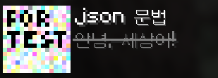

<br>

### obfuscated

글씨가 마구잡이로 뒤바뀌는 효과를 줘 읽을 수 없게 난독화할 수 있다.  
위와 동일하게 `true`, `false`로 설정할 수 있으며 `false`라면 사용하지 않아도 된다.
```json
{ "text": "안녕, 세상아!", "obfuscated": true }
```
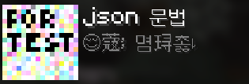

<br>

### translate

마인크래프트의 언어 파일에 있는 문자열을 사용할 수 있다.  
언어파일은 assets에서

```
📁 assets
    ↳ 📁minecraft
        ↳ 📁lang
```
에서 찾을 수 있다.

예를 들어 해당 경로에 있는 ko_kr.json에 있는
```json
"advMode.mode.redstoneTriggered": "레드스톤 필요",
```
를 참고해서 description에
```json
{ "translate": "advMode.mode.redstoneTriggered" }
```
라고 넣었다면 이렇게 표시되며

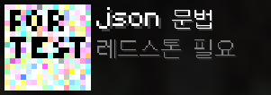

게임 세팅에서 언어를 바꾸면 해당 문구도 같이 바뀌게 된다.

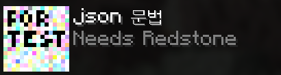

여러 언어로 특정 문구로 전하고 싶을 때 쓸 수 있으며  
다만 직접 문자열을 만들지는 못한다.

<br>

## json 작성 팁

> 이 부분은 json을 다룰 줄 안다면 읽지 않아도 된다.

### 줄 바꿈, 띄어쓰기, 들여 쓰기가 반드시 필요한가?  
문자열 내부가 아니라면 공백과 줄 바꿈은 데이터에 아무런 영향을 미치지 않으며  
이걸 쓰는 이유는 가독성을 위해서다.  
들여 쓰기는 코드 편집기를 사용한다면 대부분 줄 바꿈을 했을 때 자동으로 넣어진다.

### 메모장으로 해도 되는가?
코드 편집기가 아니라 메모장을 써도 상관은 없다.  
다만 코드 편집기를 사용하는 것을 추천하는데 그 이유는 초반에는 실수할 일이 많아서이다.  
예를 들어서 괄호 뒤에 쉼표( , )를 붙이는 것을 깜빡한다거나 등의 실수가 있을 경우  
코드 편집기를 사용하면 바로바로 오류를 찾을 수 있기 때문에 훨씬 편리하다.
