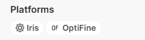

# 버전별 셰이더팩 설치 필요 모드 목록

::: info **💡 참고**
네오폿지와 폿지는 다른겁니다.  
커스폿지[^curseforge]는 모드런처가 아니며 폿지와 다릅니다.
:::
::: info ⚠️ 옵티파인 사용 시 주의점
최신버전에서도 옵티파인을 사용해도 되나  
만약 다른 모드와 사용 시 모드 호환성이 매우 안 좋기 때문에 권장드리지 않습니다.  
대체 모드 및 자세한 이유는 이 부분을 읽어주세요.  
[옵티파인에 대해서](#optifine)
:::

## 1.16.5 ~ 1.21.* 패브릭/네오폿지

- [Iris Shader](https://modrinth.com/mod/iris)
- [Sodium](https://modrinth.com/mod/sodium)
> Iris Shader 종속성

### **같이 설치하는 것을 권장하는 모드**
- [Mod Menu](https://modrinth.com/mod/modmenu)
> 패브릭에서 모드 목록이 보이게 해주는 모드
- [Sodium Extra](https://modrinth.com/mod/sodium-extra)
> Sodium 비디오 설정에서 파티클, 구름 설정과 같은 설정을 추가적으로 할 수 있는 모드 
- [Reese's Sodium Options](https://modrinth.com/mod/reeses-sodium-options)
> Sodium으로 바뀐 비디오 설정 UI를 개선해 주는 모드

## 1.16.5 ~ 1.20.1 폿지

::: warning **⚠️ 주의**
1.16 이상의 버전부터는 폿지의 사용을 권장하지 않습니다.[^forge]
:::

- [Oculus](https://modrinth.com/mod/oculus)
> Iris Shader의 비공식 폿지 포크
- [Embedium](https://modrinth.com/mod/embeddium)
> Oculus 종속성 / Sodium 비공식 포크 기반 폿지 모드

### **같이 설치하는것을 권장하는 모드**
- [Embeddium (Rubidium) Extra](https://modrinth.com/mod/rubidium-extra)
> Embeddium, Rubidium (Sodium) 비디오 설정에서 파티클, 구름 설정과 같은 설정을 추가적으로 할 수 있는 모드 / Sodium Extra 비공식 포크

## 1.8 ~ 1.15.2 폿지

- [옵티파인](https://optifine.net/downloads)

## 1.7.10 폿지

- [옵티파인](https://optifine.net/downloads)
  
### 다른 모드를 사용하는 경우
::: info ⚠️ 모드 호환성 주의
일부 모드들은 호환성 때문에 옵티파인 대신 Angelica를 권장합니다.  
사용하는 모드들이 옵티파인과 호환되는지 확인이 필요할 수 있습니다.
:::

- [Angelica](https://modrinth.com/mod/angelica)

## 1.7.2 폿지

- [옵티파인](https://optifine.net/downloads)

 

## 모드런처란?
모드런처는 모드를 실행하기 위한 기초 모드입니다.  
현제 크게 사용되는 모드 런처로는 크게 세 가지가 있으며 각각의 장단점이 존재합니다.  

### 패브릭 Fabric
https://fabricmc.net  
1.14부터 지원하는 신세대 모드입니다.  
최신 버전에서 가장 많은 모드가 제작되었습니다.  

### 네오폿지 NeoForge
https://neoforged.net  
1.20.10부터 지원하는 폿지의 후속 모드런처입니다.  
폿지보다 더 좋은 안정성을 가지고 있으며  
대부분의 모드가 최신 버전에서 폿지에서 네오폿지로 프로젝트를 이동 중입니다.  

### 폿지 Forge
https://files.minecraftforge.net/net/minecraftforge/forge  
1.4부터 지원하는 가장 오래된 런처입니다.  
현제는 논란 때문에 낮은 안정성과 느린 업데이트 속도를 가지고 있으나  
오래된 버전일수록 모드가 훨씬 많고  
다른 모드런처들이 지원하지 않는 오래된 버전도 지원합니다.

## 옵티파인에 대해서 {#optifine}

### 최신 버전에서 옵티파인을 권장하지 않는 이유
옵티파인은 최신 버전에서 불안정하며 업데이트가 느릴 수 있습니다.  
또한 옵티파인은 다른 모드와 호환성이 매우 안 좋기 때문에 다른 모드와 함께 사용할 경우  
옵티파인 대신 Iris Shader 모드를 사용하는 건 모든 모드가 권장하는 방법입니다.  

특히나 패브릭 세대로 오면서 최적화등의 그래픽 관련 모드가 굉장히 많아졌기 때문에  
매우 매우 높은 확률로 충돌이 나거나 일부 그래픽 기능이 비정상적으로 작동할 수 있습니다.  

### 최신 버전에서 옵티파인 기능을 사용하고 싶을 경우  
이어지는 블록 텍스쳐와 같이 최신 버전에서도 옵티파인의 여러 기능을 사용하고 싶을 경우  
[Fabulously Optimized](https://modrinth.com/modpack/fabulously-optimized) 모드팩을 사용하는 것을 추천합니다.

### 옵티파인과 Iris Shader간의 호환성  
Iris Shader는 옵티파인의 셰이더 파이프라인을 그대로 지원하기 때문에 대부분 호환이 되나  
일부 셰이더들은 Iris Shader에서만 지원하는 기능을 사용합니다. 

셰이더 커뮤니티에서 공식으로 권장하는 플랫폼인 [Modrinth](https://modrinth.com/shaders)에서  
셰이더 페이지에서 오른쪽 `Compatibility` 항에 **Platform** 부분에  
지원하는 셰이더 모드가 적혀있으니 확인해 보는 것을 추천드립니다.  

## 셰이더 관련 세부사항  
다음 문서에서 추천 셰이더 목록, 다운로드 시 주의사항 등등 등을 확인할 수 있습니다.
- [셰이더팩 추천 목록](/java/shader_rec/shader_rec)

## 옵티파인 설치법

::: warning 🔨 공사 중
아직 작업이 진행 중인 문서입니다.
:::

## 각주

[^curseforge]: **커스폿지**는 모드 등을 업로드하는 플랫폼의 이름이자  
모드들을 설치하고 관리하는 앱의 이름입니다.  
모드런처는 모드를 실행하기 위한 모드, 커스폿지앱은 이를 관리하는 프로그램 같은 역할입니다.

[^forge]: **폿지**는 현제 논란으로 인해 많은 개발자들이 떠난 상황입니다.  
대부분의 개발자들은 네오폿지로 개발을 옮겼으며  
때문에 현제 대부분의 폿지로 된 프로젝트가 네오폿지로 프로젝트 이동을 진행중이기 때문에  
가능하면 사용 중인 모드를 네오폿지 또는 패브릭으로 이동시키시는 걸 추천드립니다.
